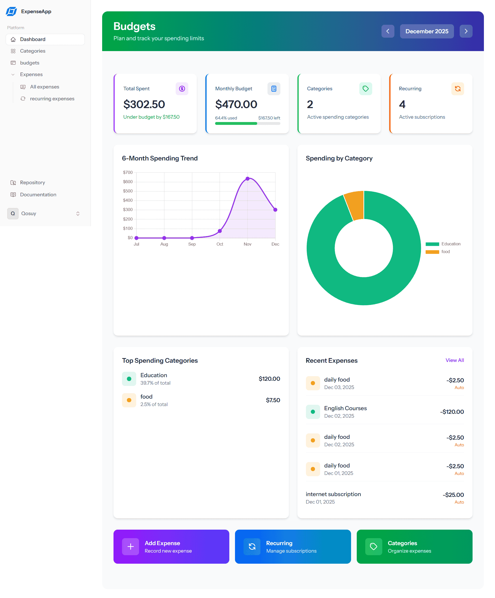
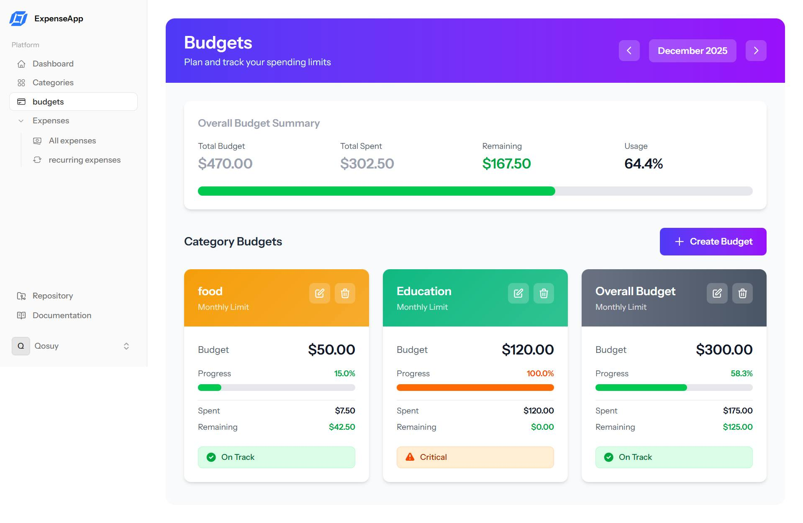
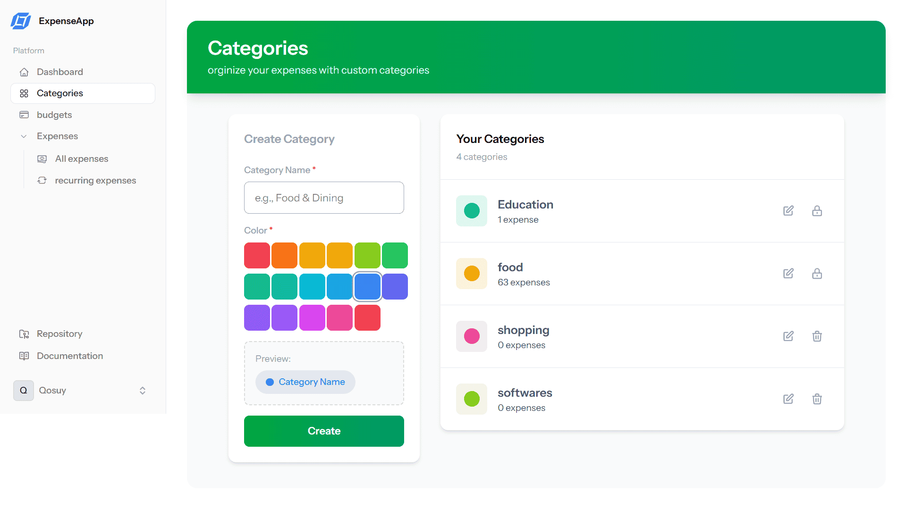
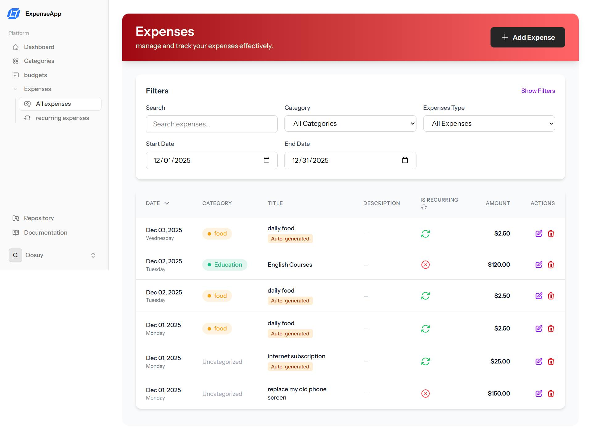
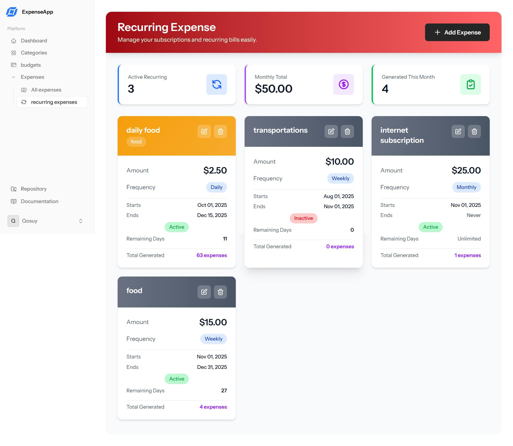

# Smart Expense Tracking App

A full-stack, modern, and intuitive web application designed to help you manage your personal finances with ease. Track your expenses, create budgets, and gain insights into your spending habits through a beautiful and responsive interface.

This application is built with the **TALL stack** (Tailwind CSS, Alpine.js, Laravel, and Livewire), offering a reactive, single-page application experience with the power and simplicity of PHP.

---

## ✨ Features

-   **Interactive Dashboard:** Get a comprehensive overview of your finances for the current month, including total spending, budget adherence, and a 6-month spending trend chart.

-   **Expense Tracking:** Easily add, view, and manage your daily expenses.

-   **Budget Management:** Set monthly budgets for your entire spending or for specific categories to keep your finances in check. Visualize your progress with clear indicators.

-   **Category Organization:** Create custom categories with unique colors to classify your expenses and understand where your money is going.

-   **Recurring Expenses:** Track subscriptions and recurring payments automatically.

-   **Data Visualization:** Interactive charts for spending by category and monthly trends, powered by Chart.js.

-   **Responsive Design:** A seamless experience across desktop, tablet, and mobile devices.

-   **Dark Mode:** Easy on the eyes for late-night budgeting sessions.

-   **Real-time Feedback:** Instant form validation and updates powered by Livewire.

## 📸 Screenshots

### Dashboard

### Budgets

### Categories

### Expenses

### Recurring Expenses

